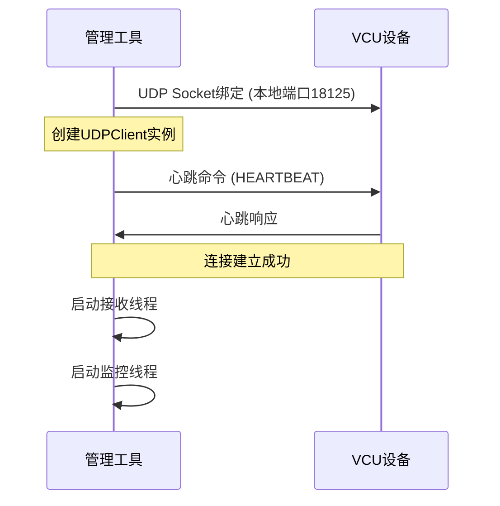
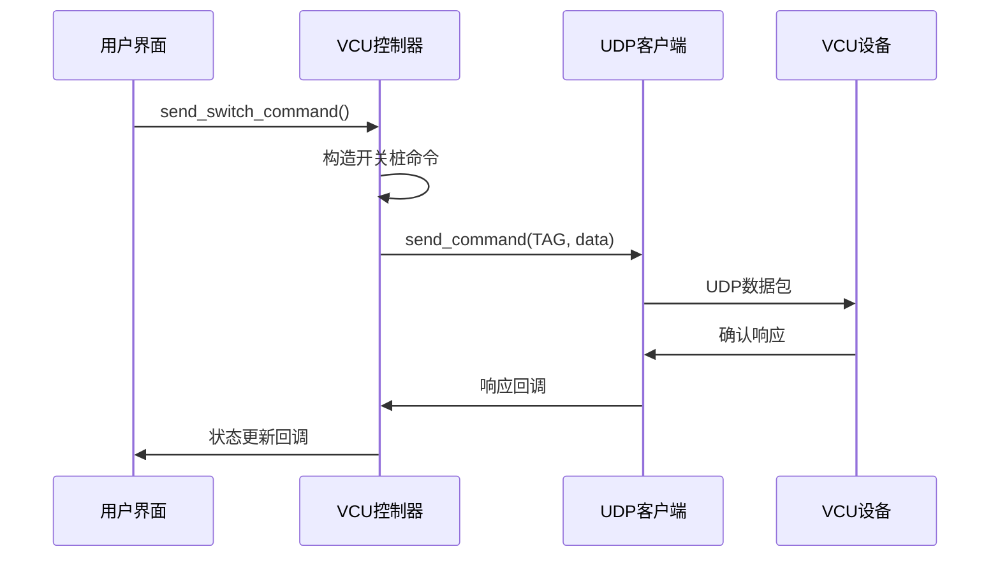
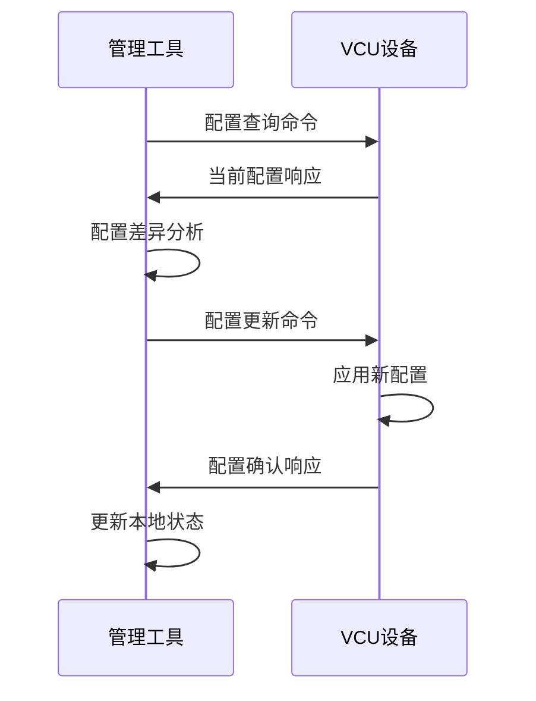
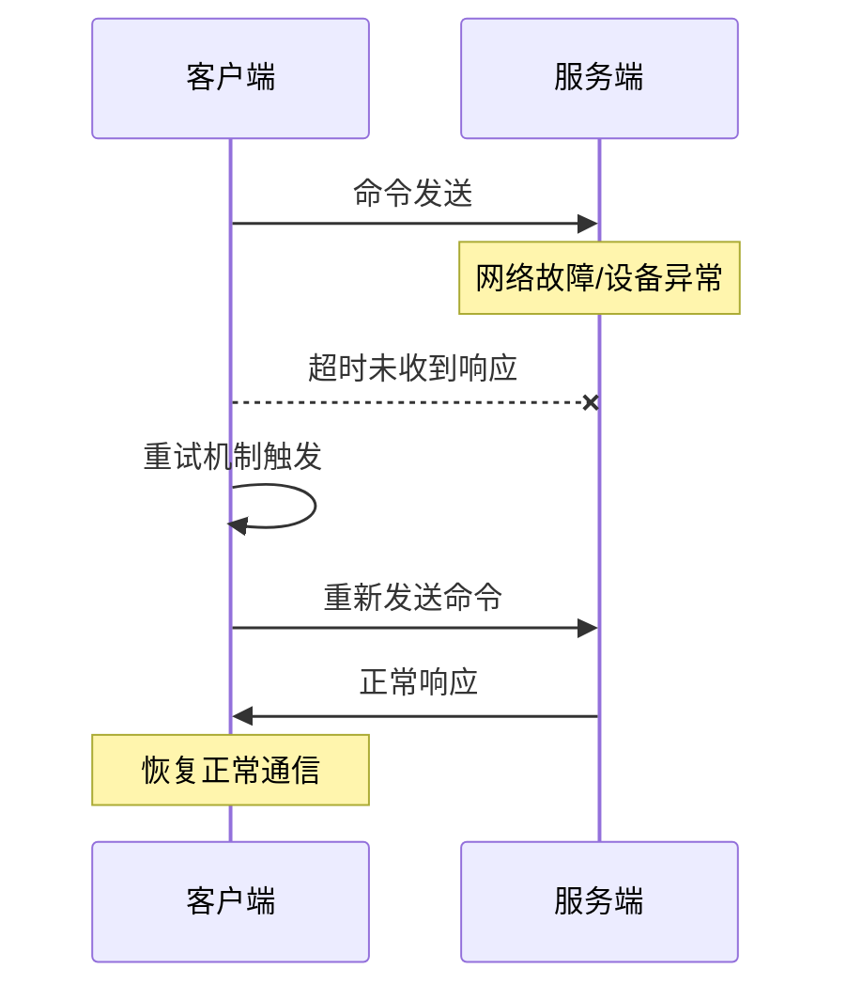

# VCU测试开关桩管理工具 - UDP通信协议设计规范

## 文档信息

- **文档版本**: v2.0.0
- **协议版本**: v1.0.0
- **最后更新**: 2024-12-26
- **设计团队**: VCU Test Platform Team

## 目录

1. [协议概述](#1-协议概述)
2. [通信架构](#2-通信架构)
3. [数据帧格式](#3-数据帧格式)
4. [数据类型定义](#4-数据类型定义)
5. [命令格式规范](#5-命令格式规范)
6. [通信流程](#6-通信流程)
7. [错误处理机制](#7-错误处理机制)
8. [安全与可靠性](#8-安全与可靠性)
9. [性能优化](#9-性能优化)
10. [协议扩展](#10-协议扩展)

---

## 1. 协议概述

### 1.1 设计目标

VCU测试开关桩管理工具采用基于UDP的自定义通信协议，旨在实现：

- **高效通信**: 低延迟、高吞吐量的VCU设备控制
- **可靠传输**: 基于应用层的可靠性保证机制
- **灵活扩展**: 支持多种数据类型和命令格式
- **故障诊断**: 完善的错误检测和故障恢复机制
- **标准化**: 统一的数据格式和通信规范

### 1.2 协议特性

| 特性 | 描述 | 实现方式 |
|------|------|----------|
| 传输协议 | UDP | 低延迟、无连接 |
| 数据格式 | 二进制 | 高效编解码 |
| 寻址方式 | 节点ID | 支持多设备管理 |
| 可靠性 | 应用层确认 | ACK/NACK机制 |
| 安全性 | 数据校验 | CRC32校验和 |
| 扩展性 | 模块化设计 | 插件式数据类型 |

### 1.3 应用场景

- **VCU设备控制**: 远程开关桩操作和状态监控
- **配置管理**: 动态配置参数下发和同步
- **日志采集**: 实时日志和诊断数据收集
- **维护操作**: 设备维护和故障诊断
- **性能监控**: 系统性能指标采集和分析

---

## 2. 通信架构

### 2.1 网络拓扑

```
┌─────────────────┐    UDP/IP     ┌─────────────────┐
│  管理工具客户端   │◄─────────────►│   VCU设备 Slot2  │
│  (20.2.1.100)   │               │   (20.2.1.10)   │
└─────────────────┘               └─────────────────┘
        │                                   │
        │          UDP/IP                   │
        │◄─────────────────────────────────►│
        │                                   │
┌─────────────────┐               ┌─────────────────┐
│   VCU设备 Slot16 │               │   VCU设备 Slot3  │
│   (20.1.1.10)   │               │   (20.3.1.10)   │
└─────────────────┘               └─────────────────┘
```

### 2.2 通信模式

#### 2.2.1 点对点通信模式
- **管理工具 ↔ VCU设备**: 直接UDP通信
- **端口号**: 18125 (标准端口)
- **连接类型**: 无连接状态，基于请求-响应

#### 2.2.2 转发通信模式  
- **安全VCU设备**: 通过主系VCU转发通信
- **网关设备**: MVCU作为通信网关
- **路由策略**: 基于槽位ID的智能路由

### 2.3 网络配置参数

```python
# 网络配置参数
NETWORK_CONFIG = {
    'udp_port': 18125,           # 标准UDP端口
    'timeout': 5.0,              # 通信超时(秒)
    'retry_count': 3,            # 重试次数
    'heartbeat_interval': 10.0,  # 心跳间隔(秒)
    'buffer_size': 4096,         # 接收缓冲区大小
    'max_packet_size': 1472      # 最大数据包大小(避免分片)
}
```

---

## 3. 数据帧格式

### 3.1 帧结构概览

UDP数据帧采用固定长度的帧头加可变长度的数据部分：

```
 0                   1                   2                   3
 0 1 2 3 4 5 6 7 8 9 0 1 2 3 4 5 6 7 8 9 0 1 2 3 4 5 6 7 8 9 0 1
+-+-+-+-+-+-+-+-+-+-+-+-+-+-+-+-+-+-+-+-+-+-+-+-+-+-+-+-+-+-+-+-+
|  DST_NODE_ID  |  SRC_NODE_ID  |  DATA_TYPE    |  DATA_LENGTH  |
+-+-+-+-+-+-+-+-+-+-+-+-+-+-+-+-+-+-+-+-+-+-+-+-+-+-+-+-+-+-+-+-+
|  DATA_SIZE    |   RESERVED    |   RESERVED    |   RESERVED    |
+-+-+-+-+-+-+-+-+-+-+-+-+-+-+-+-+-+-+-+-+-+-+-+-+-+-+-+-+-+-+-+-+
|                         DATA PAYLOAD                          |
|                          (可变长度)                            |
+-+-+-+-+-+-+-+-+-+-+-+-+-+-+-+-+-+-+-+-+-+-+-+-+-+-+-+-+-+-+-+-+
```

### 3.2 帧头字段定义

| 字段 | 长度(字节) | 偏移 | 描述 | 取值范围 |
|------|------------|------|------|----------|
| DST_NODE_ID | 1 | 0 | 目标节点ID | 0x01-0xFE, 0xFF=广播 |
| SRC_NODE_ID | 1 | 1 | 源节点ID | 0x01-0xFE, 0xFF=管理工具 |
| DATA_TYPE | 1 | 2 | 数据类型标识 | 见数据类型定义 |
| DATA_LENGTH | 1 | 3 | 数据长度字段 | 0-255 |
| DATA_SIZE | 1 | 4 | 实际数据大小 | 0-255 |
| RESERVED | 3 | 5-7 | 保留字段 | 0x00(预留扩展) |

### 3.3 Python实现

```python
@dataclass
class UDPFrame:
    """UDP数据帧结构"""
    dst_node_id: int = 0xFF      # 目标节点ID
    src_node_id: int = 0xFF      # 源节点ID  
    data_type: DataType = DataType.LOG  # 数据类型
    data_len: int = 0            # 数据长度
    data: bytes = b''            # 数据内容
    
    def pack(self) -> bytes:
        """打包数据帧为二进制格式"""
        header = struct.pack('BBBBBxxx', 
                           self.dst_node_id,
                           self.src_node_id, 
                           self.data_type.value,
                           self.data_len,
                           len(self.data))
        return header + self.data
    
    @classmethod
    def unpack(cls, data: bytes) -> 'UDPFrame':
        """从二进制数据解包数据帧"""
        if len(data) < 8:
            raise ValueError("数据长度不足")
        
        header = struct.unpack('BBBBBxxx', data[:8])
        frame = cls()
        frame.dst_node_id = header[0]
        frame.src_node_id = header[1]
        frame.data_type = DataType(header[2])
        frame.data_len = header[3]
        frame.data = data[8:8+frame.data_len] if frame.data_len > 0 else b''
        
        return frame
```

---

## 4. 数据类型定义

### 4.1 基础数据类型

```python
class DataType(Enum):
    """数据类型枚举定义"""
    TAG = 0x00      # 开关桩数据 (Tag Switch Data)
    CONF = 0x02     # 配置数据 (Configuration Data)  
    LOG = 0x0E      # 日志数据 (Log Data)
    MAINT = 0x04    # 维护数据 (Maintenance Data)
```

### 4.2 数据类型详细说明

#### 4.2.1 开关桩数据 (TAG = 0x00)

**用途**: 开关桩状态控制和查询

**数据格式**:
```
+--------+--------+----------+--------+
| CMD(1) | LEN(1) |  NAME    | VAL(1) |
+--------+--------+----------+--------+
```

**字段说明**:
- `CMD`: 命令类型 (0x01=设置, 0x02=查询, 0x03=响应)
- `LEN`: 开关桩名称长度
- `NAME`: 开关桩名称 (UTF-8编码)
- `VAL`: 开关桩值 (0x00=关闭, 0x01=开启)

#### 4.2.2 配置数据 (CONF = 0x02)

**用途**: 系统配置参数设置和同步

**数据格式**:
```
+--------+----------+----------+
| CMD(1) | LEN(2)   |   JSON   |
+--------+----------+----------+
```

**字段说明**:
- `CMD`: 命令类型 (0x02=设置配置)
- `LEN`: JSON数据长度 (大端字节序)
- `JSON`: 配置数据 (JSON格式, UTF-8编码)

#### 4.2.3 日志数据 (LOG = 0x0E)

**用途**: 系统日志和诊断信息传输

**数据格式**:
```
+--------+----------+----------+----------+
| LVL(1) | TS(4)    | LEN(2)   | MESSAGE  |
+--------+----------+----------+----------+
```

**字段说明**:
- `LVL`: 日志级别 (0=DEBUG, 1=INFO, 2=WARN, 3=ERROR, 4=CRITICAL)
- `TS`: 时间戳 (Unix timestamp, 大端字节序)
- `LEN`: 消息长度
- `MESSAGE`: 日志消息 (UTF-8编码)

#### 4.2.4 维护数据 (MAINT = 0x04)

**用途**: 设备维护和系统控制

**数据格式**:
```
+--------+----------+
| CMD(1) |   DATA   |
+--------+----------+
```

**维护命令定义**:
```python
class VCUCommand(Enum):
    """VCU命令类型"""
    SWITCH_TAG = 0x01       # 开关桩命令
    SET_CONFIG = 0x02       # 设置配置
    GET_STATUS = 0x03       # 获取状态
    RESET = 0x04           # 重置设备
    MAINTENANCE = 0x05      # 维护模式
    HEARTBEAT = 0x06       # 心跳命令
```

---

## 5. 命令格式规范

### 5.1 开关桩命令格式

#### 5.1.1 设置开关桩命令

```python
def build_switch_command(switch_name: str, switch_value: bool) -> bytes:
    """构造开关桩设置命令"""
    name_bytes = switch_name.encode('utf-8')
    command_data = bytes([0x01]) +              # 命令类型：设置
                  bytes([len(name_bytes)]) +    # 名称长度
                  name_bytes +                  # 开关桩名称
                  bytes([1 if switch_value else 0])  # 开关桩值
    return command_data
```

**示例命令**:
```
设置 "VCU_COMM_ENABLE" = True
数据: 01 10 56 43 55 5F 43 4F 4D 4D 5F 45 4E 41 42 4C 45 01
解析: 
  - 01: 设置命令
  - 10: 名称长度(16字节)
  - 56...45: "VCU_COMM_ENABLE"
  - 01: 开启状态
```

#### 5.1.2 查询开关桩命令

```python
def build_query_command(switch_name: str) -> bytes:
    """构造开关桩查询命令"""
    name_bytes = switch_name.encode('utf-8')
    command_data = bytes([0x02]) +              # 命令类型：查询
                  bytes([len(name_bytes)]) +    # 名称长度
                  name_bytes                    # 开关桩名称
    return command_data
```

#### 5.1.3 开关桩响应格式

```python
def parse_switch_response(data: bytes) -> tuple:
    """解析开关桩响应数据"""
    if len(data) < 3:
        raise ValueError("响应数据格式错误")
    
    cmd_type = data[0]          # 0x03: 响应
    name_len = data[1]          # 名称长度
    switch_name = data[2:2+name_len].decode('utf-8')
    switch_value = bool(data[2+name_len]) if len(data) > 2+name_len else None
    
    return switch_name, switch_value
```

### 5.2 配置命令格式

#### 5.2.1 配置设置命令

```python
def build_config_command(config_data: Dict[str, Any]) -> bytes:
    """构造配置设置命令"""
    import json
    config_json = json.dumps(config_data, ensure_ascii=False).encode('utf-8')
    command_data = bytes([0x02]) +              # 命令类型：设置配置
                  len(config_json).to_bytes(2, 'big') +  # JSON长度
                  config_json                   # JSON配置数据
    return command_data
```

**配置示例**:
```json
{
    "network": {
        "timeout": 5000,
        "retry_count": 3
    },
    "logging": {
        "level": "INFO",
        "file_output": true
    }
}
```

### 5.3 心跳命令格式

```python
def build_heartbeat_command() -> bytes:
    """构造心跳命令"""
    import time
    timestamp = int(time.time())
    command_data = bytes([0x06]) +              # 命令类型：心跳
                  timestamp.to_bytes(4, 'big')  # 时间戳
    return command_data
```

---

## 6. 通信流程

### 6.1 连接建立流程



### 6.2 开关桩操作流程



### 6.3 配置同步流程



### 6.4 错误恢复流程



---

## 7. 错误处理机制

### 7.1 错误分类

| 错误类型 | 错误代码 | 描述 | 处理策略 |
|----------|----------|------|----------|
| 网络错误 | 0x1000-0x1FFF | 网络连接、超时等 | 重试+降级 |
| 协议错误 | 0x2000-0x2FFF | 数据格式、校验失败 | 拒绝+日志 |
| 业务错误 | 0x3000-0x3FFF | 命令执行失败 | 回滚+通知 |
| 系统错误 | 0x4000-0x4FFF | 设备故障、资源不足 | 告警+维护 |

### 7.2 超时处理

```python
class TimeoutHandler:
    """超时处理器"""
    
    def __init__(self, timeout: float = 5.0, max_retries: int = 3):
        self.timeout = timeout
        self.max_retries = max_retries
    
    def send_with_retry(self, client: UDPClient, frame: UDPFrame) -> bool:
        """带重试的发送机制"""
        for attempt in range(self.max_retries):
            try:
                if client.send_frame(frame):
                    return True
                
                # 等待响应
                if self._wait_for_response(client, self.timeout):
                    return True
                    
            except Exception as e:
                logger.warning(f"发送尝试 {attempt + 1} 失败: {e}")
            
            # 指数退避
            time.sleep(0.5 * (2 ** attempt))
        
        return False
```

### 7.3 数据校验

```python
import zlib

def add_checksum(data: bytes) -> bytes:
    """添加CRC32校验和"""
    checksum = zlib.crc32(data) & 0xffffffff
    return data + checksum.to_bytes(4, 'big')

def verify_checksum(data: bytes) -> bool:
    """验证CRC32校验和"""
    if len(data) < 4:
        return False
    
    payload = data[:-4]
    received_checksum = int.from_bytes(data[-4:], 'big')
    calculated_checksum = zlib.crc32(payload) & 0xffffffff
    
    return received_checksum == calculated_checksum
```

### 7.4 异常恢复策略

```python
class RecoveryManager:
    """异常恢复管理器"""
    
    def handle_connection_lost(self, client: UDPClient):
        """处理连接丢失"""
        logger.warning("检测到连接丢失，开始恢复流程")
        
        # 1. 停止当前连接
        client.disconnect()
        
        # 2. 等待网络稳定
        time.sleep(2.0)
        
        # 3. 重新建立连接
        for attempt in range(3):
            if client.connect():
                logger.info("连接恢复成功")
                return True
            time.sleep(5.0)
        
        logger.error("连接恢复失败")
        return False
    
    def handle_device_error(self, device_id: str, error_code: int):
        """处理设备错误"""
        if error_code in [0x3001, 0x3002]:  # 可恢复错误
            self._trigger_device_reset(device_id)
        elif error_code >= 0x4000:  # 系统错误
            self._mark_device_maintenance(device_id)
```

---

## 8. 安全与可靠性

### 8.1 安全机制

#### 8.1.1 访问控制

```python
class SecurityManager:
    """安全管理器"""
    
    def __init__(self):
        self.allowed_nodes = {0x02, 0x03, 0x16}  # 允许的节点ID
        self.rate_limiter = {}  # 速率限制器
    
    def validate_source(self, src_node_id: int, src_ip: str) -> bool:
        """验证数据源合法性"""
        # 检查节点ID白名单
        if src_node_id not in self.allowed_nodes:
            logger.warning(f"未授权的节点ID: {src_node_id}")
            return False
        
        # 检查IP地址白名单
        allowed_ips = ["20.2.1.10", "20.1.1.10", "20.3.1.10"]
        if src_ip not in allowed_ips:
            logger.warning(f"未授权的IP地址: {src_ip}")
            return False
        
        return True
    
    def check_rate_limit(self, src_node_id: int) -> bool:
        """检查速率限制"""
        current_time = time.time()
        
        if src_node_id not in self.rate_limiter:
            self.rate_limiter[src_node_id] = []
        
        # 清理过期记录
        requests = self.rate_limiter[src_node_id]
        requests[:] = [t for t in requests if current_time - t < 60]  # 1分钟窗口
        
        # 检查是否超过限制
        if len(requests) >= 100:  # 每分钟最多100个请求
            logger.warning(f"节点 {src_node_id} 超过速率限制")
            return False
        
        requests.append(current_time)
        return True
```

#### 8.1.2 数据完整性

```python
def create_secure_frame(dst_node: int, data_type: DataType, payload: bytes) -> bytes:
    """创建安全数据帧"""
    # 1. 构造基础帧
    frame = UDPFrame(
        dst_node_id=dst_node,
        src_node_id=0xFF,
        data_type=data_type,
        data_len=len(payload),
        data=payload
    )
    
    # 2. 添加时间戳
    timestamp = int(time.time()).to_bytes(4, 'big')
    frame.data = timestamp + frame.data
    frame.data_len = len(frame.data)
    
    # 3. 添加校验和
    frame_data = frame.pack()
    checksum = zlib.crc32(frame_data) & 0xffffffff
    
    return frame_data + checksum.to_bytes(4, 'big')
```

### 8.2 可靠性保证

#### 8.2.1 消息去重

```python
class MessageDeduplicator:
    """消息去重器"""
    
    def __init__(self, window_size: int = 1000):
        self.seen_messages = {}
        self.window_size = window_size
    
    def is_duplicate(self, src_node: int, message_hash: int) -> bool:
        """检查是否为重复消息"""
        key = f"{src_node}:{message_hash}"
        current_time = time.time()
        
        if key in self.seen_messages:
            last_time = self.seen_messages[key]
            if current_time - last_time < 30:  # 30秒去重窗口
                return True
        
        self.seen_messages[key] = current_time
        
        # 清理过期记录
        if len(self.seen_messages) > self.window_size:
            self._cleanup_old_entries()
        
        return False
```

#### 8.2.2 消息确认机制

```python
class AcknowledgmentManager:
    """确认应答管理器"""
    
    def __init__(self):
        self.pending_acks = {}  # 待确认消息
        self.ack_timeout = 5.0  # 确认超时时间
    
    def send_with_ack(self, client: UDPClient, frame: UDPFrame) -> bool:
        """发送需要确认的消息"""
        message_id = self._generate_message_id()
        
        # 在数据前添加消息ID
        ack_frame = UDPFrame(
            dst_node_id=frame.dst_node_id,
            src_node_id=frame.src_node_id,
            data_type=frame.data_type,
            data_len=frame.data_len + 4,
            data=message_id.to_bytes(4, 'big') + frame.data
        )
        
        # 记录待确认消息
        self.pending_acks[message_id] = {
            'frame': ack_frame,
            'timestamp': time.time(),
            'retry_count': 0
        }
        
        return client.send_frame(ack_frame)
    
    def handle_acknowledgment(self, message_id: int):
        """处理确认应答"""
        if message_id in self.pending_acks:
            del self.pending_acks[message_id]
            logger.debug(f"收到消息确认: {message_id}")
```

---

## 9. 性能优化

### 9.1 连接池管理

```python
class UDPConnectionPool:
    """UDP连接池"""
    
    def __init__(self, max_connections: int = 10):
        self.max_connections = max_connections
        self.active_connections = {}
        self.connection_stats = {}
        self._lock = threading.Lock()
    
    def get_connection(self, device_id: str) -> Optional[UDPClient]:
        """获取连接"""
        with self._lock:
            if device_id in self.active_connections:
                conn = self.active_connections[device_id]
                if conn.is_connected():
                    self._update_stats(device_id, 'hit')
                    return conn
                else:
                    # 移除无效连接
                    del self.active_connections[device_id]
            
            # 创建新连接
            if len(self.active_connections) >= self.max_connections:
                self._evict_least_used()
            
            return self._create_connection(device_id)
    
    def _evict_least_used(self):
        """淘汰最少使用的连接"""
        if not self.connection_stats:
            return
        
        # 找到使用次数最少的连接
        device_id = min(self.connection_stats.keys(), 
                       key=lambda k: self.connection_stats[k]['usage_count'])
        
        if device_id in self.active_connections:
            self.active_connections[device_id].disconnect()
            del self.active_connections[device_id]
            del self.connection_stats[device_id]
```

### 9.2 数据缓存策略

```python
class ResponseCache:
    """响应缓存"""
    
    def __init__(self, max_size: int = 1000, ttl: int = 300):
        self.max_size = max_size
        self.ttl = ttl  # 生存时间(秒)
        self.cache = {}
        self.access_times = {}
    
    def get(self, key: str) -> Optional[bytes]:
        """获取缓存数据"""
        if key not in self.cache:
            return None
        
        entry = self.cache[key]
        if time.time() - entry['timestamp'] > self.ttl:
            # 缓存过期
            del self.cache[key]
            if key in self.access_times:
                del self.access_times[key]
            return None
        
        self.access_times[key] = time.time()
        return entry['data']
    
    def put(self, key: str, data: bytes):
        """存储缓存数据"""
        if len(self.cache) >= self.max_size:
            self._evict_lru()
        
        self.cache[key] = {
            'data': data,
            'timestamp': time.time()
        }
        self.access_times[key] = time.time()
    
    def _evict_lru(self):
        """淘汰最久未使用的缓存"""
        if not self.access_times:
            return
        
        lru_key = min(self.access_times.keys(), 
                     key=lambda k: self.access_times[k])
        
        del self.cache[lru_key]
        del self.access_times[lru_key]
```

### 9.3 批量操作优化

```python
class BatchProcessor:
    """批量处理器"""
    
    def __init__(self, batch_size: int = 10, flush_interval: float = 1.0):
        self.batch_size = batch_size
        self.flush_interval = flush_interval
        self.pending_operations = []
        self.last_flush = time.time()
        self._lock = threading.Lock()
    
    def add_operation(self, operation: Dict[str, Any]):
        """添加操作到批处理队列"""
        with self._lock:
            self.pending_operations.append(operation)
            
            # 检查是否需要立即处理
            if (len(self.pending_operations) >= self.batch_size or
                time.time() - self.last_flush >= self.flush_interval):
                self._flush_batch()
    
    def _flush_batch(self):
        """处理批量操作"""
        if not self.pending_operations:
            return
        
        operations = self.pending_operations.copy()
        self.pending_operations.clear()
        self.last_flush = time.time()
        
        # 按设备分组操作
        device_groups = {}
        for op in operations:
            device_id = op['device_id']
            if device_id not in device_groups:
                device_groups[device_id] = []
            device_groups[device_id].append(op)
        
        # 并行处理各设备的操作
        threads = []
        for device_id, device_ops in device_groups.items():
            thread = threading.Thread(
                target=self._process_device_operations,
                args=(device_id, device_ops)
            )
            threads.append(thread)
            thread.start()
        
        # 等待所有操作完成
        for thread in threads:
            thread.join()
```

---

## 10. 协议扩展

### 10.1 版本兼容性

```python
class ProtocolVersionManager:
    """协议版本管理器"""
    
    SUPPORTED_VERSIONS = {
        0x01: "v1.0.0",  # 当前版本
        0x02: "v2.0.0",  # 预留版本
    }
    
    def __init__(self, current_version: int = 0x01):
        self.current_version = current_version
        self.version_handlers = {
            0x01: self._handle_v1_0,
            # 0x02: self._handle_v2_0,  # 未来版本
        }
    
    def negotiate_version(self, peer_version: int) -> int:
        """协商协议版本"""
        # 选择双方都支持的最高版本
        common_versions = set(self.SUPPORTED_VERSIONS.keys()) & {peer_version}
        if not common_versions:
            raise ValueError("无法协商兼容的协议版本")
        
        return max(common_versions)
    
    def handle_frame(self, frame: UDPFrame, version: int) -> bool:
        """根据版本处理数据帧"""
        handler = self.version_handlers.get(version)
        if not handler:
            logger.error(f"不支持的协议版本: {version}")
            return False
        
        return handler(frame)
```

### 10.2 插件式数据类型

```python
class DataTypeRegistry:
    """数据类型注册表"""
    
    def __init__(self):
        self.type_handlers = {}
        self.type_encoders = {}
        self.type_decoders = {}
    
    def register_data_type(self, data_type: int, handler_class: type):
        """注册新的数据类型处理器"""
        if data_type in self.type_handlers:
            logger.warning(f"数据类型 {data_type} 已存在，将被覆盖")
        
        handler = handler_class()
        self.type_handlers[data_type] = handler
        
        if hasattr(handler, 'encode'):
            self.type_encoders[data_type] = handler.encode
        
        if hasattr(handler, 'decode'):
            self.type_decoders[data_type] = handler.decode
        
        logger.info(f"已注册数据类型处理器: {data_type}")
    
    def encode_data(self, data_type: int, data: Any) -> bytes:
        """编码数据"""
        encoder = self.type_encoders.get(data_type)
        if not encoder:
            raise ValueError(f"未找到数据类型 {data_type} 的编码器")
        
        return encoder(data)
    
    def decode_data(self, data_type: int, data: bytes) -> Any:
        """解码数据"""
        decoder = self.type_decoders.get(data_type)
        if not decoder:
            raise ValueError(f"未找到数据类型 {data_type} 的解码器")
        
        return decoder(data)

# 示例：注册自定义数据类型
class CustomDataHandler:
    """自定义数据类型处理器"""
    
    def encode(self, data: Dict) -> bytes:
        """编码自定义数据"""
        import pickle
        return pickle.dumps(data)
    
    def decode(self, data: bytes) -> Dict:
        """解码自定义数据"""
        import pickle
        return pickle.loads(data)

# 注册自定义数据类型
registry = DataTypeRegistry()
registry.register_data_type(0x10, CustomDataHandler)
```

### 10.3 协议扩展点

#### 10.3.1 帧头扩展

```python
class ExtendedUDPFrame(UDPFrame):
    """扩展UDP数据帧"""
    
    def __init__(self, *args, **kwargs):
        super().__init__(*args, **kwargs)
        self.version = 0x01         # 协议版本
        self.flags = 0x00           # 扩展标志
        self.sequence = 0           # 序列号
        self.checksum = 0           # 校验和
    
    def pack(self) -> bytes:
        """打包扩展数据帧"""
        # 基础帧头
        base_header = struct.pack('BBBBBxxx',
                                self.dst_node_id,
                                self.src_node_id,
                                self.data_type.value,
                                self.data_len,
                                len(self.data))
        
        # 扩展帧头
        ext_header = struct.pack('BBH',
                               self.version,    # 协议版本
                               self.flags,      # 标志位
                               self.sequence)   # 序列号
        
        frame_data = base_header + ext_header + self.data
        
        # 计算校验和
        self.checksum = zlib.crc32(frame_data) & 0xffffffff
        
        return frame_data + self.checksum.to_bytes(4, 'big')
```

#### 10.3.2 命令扩展机制

```python
class CommandExtensionManager:
    """命令扩展管理器"""
    
    def __init__(self):
        self.command_handlers = {}
        self.command_validators = {}
    
    def register_command(self, cmd_type: int, handler: Callable, validator: Callable = None):
        """注册新命令类型"""
        self.command_handlers[cmd_type] = handler
        if validator:
            self.command_validators[cmd_type] = validator
        
        logger.info(f"已注册命令类型: 0x{cmd_type:02X}")
    
    def execute_command(self, cmd_type: int, data: bytes) -> bytes:
        """执行命令"""
        # 验证命令
        validator = self.command_validators.get(cmd_type)
        if validator and not validator(data):
            raise ValueError(f"命令验证失败: 0x{cmd_type:02X}")
        
        # 执行命令
        handler = self.command_handlers.get(cmd_type)
        if not handler:
            raise ValueError(f"未知命令类型: 0x{cmd_type:02X}")
        
        return handler(data)

# 示例：注册新命令
def handle_custom_command(data: bytes) -> bytes:
    """处理自定义命令"""
    logger.info(f"执行自定义命令，数据长度: {len(data)}")
    return b"OK"

def validate_custom_command(data: bytes) -> bool:
    """验证自定义命令"""
    return len(data) >= 4  # 至少4字节数据

cmd_manager = CommandExtensionManager()
cmd_manager.register_command(0x20, handle_custom_command, validate_custom_command)
```

---

## 附录

### A. 错误代码表

| 代码范围 | 分类 | 描述 |
|----------|------|------|
| 0x0000 | 成功 | 操作成功 |
| 0x1000-0x1FFF | 网络错误 | 连接失败、超时、网络不可达 |
| 0x2000-0x2FFF | 协议错误 | 格式错误、校验失败、版本不兼容 |
| 0x3000-0x3FFF | 业务错误 | 命令执行失败、参数错误 |
| 0x4000-0x4FFF | 系统错误 | 设备故障、资源不足、内部错误 |

### B. 性能指标

| 指标 | 目标值 | 监控方法 |
|------|--------|----------|
| 响应时间 | < 100ms | UDP往返时间测量 |
| 吞吐量 | > 1000 ops/s | 每秒处理命令数 |
| 丢包率 | < 0.1% | 发送/接收统计 |
| 连接数 | < 100 | 并发连接监控 |
| 内存使用 | < 100MB | 进程内存监控 |

### C. 配置参数参考

```yaml
# UDP通信配置
udp:
  port: 18125
  timeout: 5.0
  retry_count: 3
  buffer_size: 4096
  max_packet_size: 1472

# 性能配置
performance:
  connection_pool_size: 10
  cache_size: 1000
  cache_ttl: 300
  batch_size: 10
  flush_interval: 1.0

# 安全配置
security:
  enable_checksum: true
  enable_rate_limit: true
  max_requests_per_minute: 100
  allowed_nodes: [2, 3, 16]
```

---

**文档版本**: v2.0.0  
**最后更新**: 2024-12-26  
**维护团队**: VCU Test Platform Development Team 